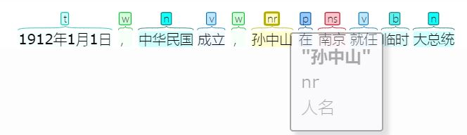
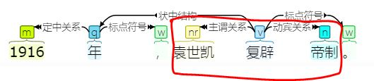
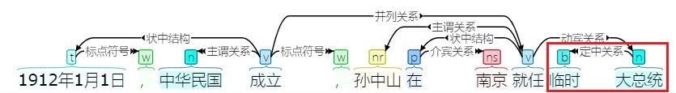
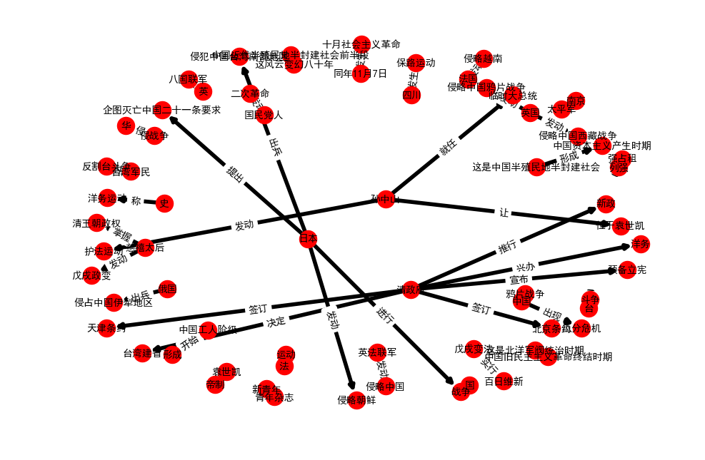

博客： https://blog.csdn.net/blmoistawinde/article/details/86557070

# 准备考试？python也能帮你划重点，上考场（误）

打开查分界面，我看到我的“中国近现代史纲要”一栏露出了难看的脸色。

这时，一个程序突然自告奋勇：“不就是这种简单的考试吗？让我学一下你们的课本，我也能够上考场！”

我把我的课本文本输入给它。不到一分钟以后，它对我说：“我学完了，来考我吧。”

虽然也只是在考前突击了两天，但我对它如此之快的速度还是深感嫉妒。我问：“你知道孙中山先生都干了哪些事情吗？”

“发动护法运动、就任临时大总统、让位于袁世凯”

“不错吗，你是怎么做到的？”

“让我给你细细讲来吧……”


```python
import os
import re
import pandas as pd
import numpy as np
import networkx as nx
import matplotlib.pyplot as plt
# matplotlib显示中文和负号问题
plt.rcParams['font.sans-serif'] = ['SimHei']
plt.rcParams['axes.unicode_minus'] = False 
import warnings
warnings.filterwarnings("ignore")
from collections import defaultdict
from harvesttext import HarvestText
from naiveKGQA import NaiveKGQA
```


```python
doc = """
四、基本历史线索：1840—1919年的中国
自1840年鸦片战争至1919年五四运动，这风云变幻的八十年，是中国近代半殖民地半封建社会的前半段和中国旧民主主义革命时期。这八十年的历史大体上又可以划分为以下四个阶段：
（一）从1840年鸦片战争到1864年太平天国失败，这是中国半殖民地半封建社会开端和农民战争时期。
1840—1842年，英国发动侵略中国的鸦片战争。战后，先后签订中英《南京条约》、中美《望厦条约》、中法《黄埔条约》等一系列不平等条约。
19世纪40—70年代，中国工人阶级开始形成。
1851年，洪秀全领导金田起义。1853年，太平军定都南京（天京）。1856年，太平天国天京事变。
1856—1860年，英法联军发动侵略中国的第二次鸦片战争。1858年，清政府与俄、美、英、法四国分别签订《天津条约》。1860年，英法联军攻入北京，清政府与英、法、俄三国分别签订《北京条约》。
1861年，北京政变（又称辛酉政变），慈禧太后和恭亲王奕掌握清王朝政权。
1864年，太平天国失败。
（二）从1864年太平天国失败到1901年《辛丑条约》签订，这是中国半殖民地半封建社会逐步形成和中国资本主义产生时期。
19世纪60—90年代，清政府兴办洋务，史称洋务运动（又称“自强”运动）。
19世纪70年代开始，中国民族资本主义逐步产生。
1871年，俄国出兵侵占中国伊犁地区。
1874年，日本出兵侵犯中国台湾南部地区。
1883—1885年，法国发动侵略越南和中国的中法战争。
1884年，新疆建省。
1885年，清政府决定台湾建省。
1888—1889年，英国发动侵略中国西藏战争。
1894年，兴中会成立。
1894—1895年，日本发动侵略朝鲜和中国的中日甲午战争。
1895年，中日《马关条约》签订。台湾军民开展反割台斗争。
19世纪90年代，列强加紧在中国强占租借地与划分势力范围，中国出现“瓜分危机”。
1898年，戊戌变法，光绪皇帝实行“百日维新”。慈禧太后发动戊戌政变。
1899—1900年，义和团运动高潮。
1900—1901年，英、美、法、俄、日、德、意、奥组织八国联军，发动侵华战争。1901年，《辛丑条约》签订。
（三）从1901年《辛丑条约》签订到1911年辛亥革命，这是中国半殖民地化加深和中国资产阶级民主革命高涨的时期。
1901年，清政府开始推行“新政”。
1903—1904年，英国再次发动侵略中国西藏战争。
1904—1905年，日俄战争在中国东北进行。
1905年，中国同盟会在日本东京成立，孙中山被选为总理。
1905—1907年，革命派和改良派论战。
1906年，清政府宣布“预备立宪”。改良派发起立宪运动。
1911年，广州黄花岗起义。四川发生保路运动。
同年10月10日，武昌起义，辛亥革命爆发。
（四）从1911年辛亥革命到1919年五四运动前，这是北洋军阀统治时期，是中国旧民主主义革命终结和新民主主义革命酝酿的时期。
1912年1月1日，中华民国成立，孙中山在南京就任临时大总统，组成中华民国临时政府。2月12日，清帝退位。4月1日，孙中山让位于袁世凯。袁迁都北京。
同年8月，国民党成立。
1913年，国民党人发动“二次革命”，旋遭失败。
1914年，第一次世界大战爆发。
同年，日本与德国在山东进行战争，争夺在中国山东的权益。
1915年，日本提出企图灭亡中国的“二十一条”要求。袁世凯复辟帝制。
同年，《青年》杂志（后改称《新青年》）创刊，新文化运动开始。
同年，护国战争开始。
1916年，袁世凯复辟帝制失败。
1917年，张勋拥清废帝溥仪复辟帝制失败。孙中山发动护法运动。
同年11月7日，俄国发生十月社会主义革命。
1918年，护法运动失败。第一次世界大战结束。
"""
```

“首先引入一些必要的库，然后我先加载doc为1840—1919年中国大事的那一段段文本做个简单的示例，这部分代码就不用我列出来了吧。”

旁白：这里使用harvesttext库进行文本挖掘，它的许多功能能够使得文本分析的流程变得轻松简单！


```python
ht = HarvestText()
sentences = ht.cut_sentences(doc)
```

## 有哪些重要对象

“重要对象，一般都是一些专有名词。我可以利用自然语言处理中的**命名实体识别**技术就能够识别出这样的一些对象，比如：人名、地名、机构名还有其他专有名词等。”




HarvestText中包装精简了pyhanlp中的命名实体识别接口，让我们来使用它找到近代史中的重要对象吧。


```python
entity_type_dict = {}
for i, sent in enumerate(sentences):
    entity_type_dict0 = ht.named_entity_recognition(sent)
    for entity0, type0 in entity_type_dict0.items():
        entity_type_dict[entity0] = type0
for entity in list(entity_type_dict.keys())[:10]:
    print(entity, entity_type_dict[entity])
```

    中国 地名
    鸦片战争 其他专名
    五四运动 其他专名
    英国 地名
    南京 地名
    望厦 其他专名
    黄埔 地名
    不平等条约 其他专名
    洪秀全 人名
    金田 地名
    

把找到的实体登录，我们就可以统计他们出现的次数，通过词频来判断它们的重要性。


```python
ht.add_entities(entity_type_dict = entity_type_dict)
```

    Building prefix dict from the default dictionary ...
    Loading model from cache C:\Users\KELEN\AppData\Local\Temp\jieba.cache
    Loading model cost 1.125 seconds.
    Prefix dict has been built succesfully.
    


```python
inv_index = ht.build_index(sentences)
counts = ht.get_entity_counts(sentences,inv_index)
print(pd.Series(counts).sort_values(ascending=False).head())
```

    中国     21
    清政府     6
    日本      5
    孙中山     4
    英国      3
    dtype: int64
    

我：“这个分析确实有用，看着这些词我就联想到了，在1840—1919年的中国，清政府面对外敌的屈辱，以及孙中山先生为代表的有识之士的努力。但是考试不是就考这些对象，而是要考和它们有关的知识点啊。”

程序：“别着急，对于知识点，我也有办法找到。”

## 有哪些重要知识点

程序：“你们说的重要知识点，可以认为是包含了那些重要对象的事件或者事实吧。对于你们人类，事实可能就是自然语言描述的一句话。不过对于我们程序，我们要用一种标准清晰的结构来表示它。三元组组成的**知识图谱**就是一种解决方案。”

**三元组**就是类似（主语，谓词，宾语）的结构，比如：
- ['清政府', '签订', '天津条约']
- ['袁世凯', '复辟', '帝制']
- ['孙中山', '就任', '临时大总统']


我：“确实有用，三个词基本就能凝练地表达一句话中的主要事实了。但是你只有文本作为输入，你要怎么从中提取出这样的三元组呢？”

程序：“上面已经提到三元组有（主语，谓词，宾语）的结构。你要是英语课学得好的话，应该会联想到主语、谓语、宾语这些语法概念吧？而我就可以使用**依存句法分析**技术从文本中获得这些句法信息。”

分析大致是这样的：

可以看到，从主谓关系和动宾关系，我们就能够自然地得到我们需要的三元组['袁世凯', '复辟', '帝制']。

保留更多的信息，比如修饰主语的形容词，能够让三元组的意思更加完整。我们可以利用别的关系来扩充事实：

原来我们只会得到['孙中山', '就任', '大总统']。现在利用定中关系，我们就知道“临时”一次修饰“大总统”，我们就能够得到['孙中山', '就任', '临时大总统']这个更完整的事实了。

我：“我的英语学得不好，这些语法看得有点头晕。”

程序：“好吧 (￢_￢)，不过把它包装成接口以后，我们就可以很简单地使用这个技术了。现在让我们用它来找到课本里的重要知识点：”


```python
ht2 = HarvestText()
SVOs = []
for i, sent in enumerate(sentences):
    SVOs += ht2.triple_extraction(sent.strip())
print("\n".join(" ".join(tri) for tri in SVOs[5:10]))
```

    英法联军 发动 侵略中国
    清政府 签订 天津条约
    清政府 签订 北京条约
    慈禧太后 掌握 清王朝政权
    这是中国半殖民地半封建社会 形成 中国资本主义产生时期
    

程序：“怎么样？要不考虑下次你可以让我帮你划重点？”

我：“有的三元组看起来还挺不错的，但是有的感觉有点奇怪啊。”

程序：“不要在意这些细节……那是因为你们给我写的算法还有很多提升空间吗，但总体质量还是不错的。”

“有了这些结构化的知识，我就可以接着建立知识图谱，‘掌握’这些知识之间的联系。”

知识图谱长什么样呢？它可以理解为实体之间的网络，网络之间的连边就是实体之间的联系，做出一张图来直观地感受下：


```python
fig = plt.figure(figsize=(12,8),dpi=100)
g_nx = nx.DiGraph()
labels = {}
for subj, pred, obj in SVOs:
    g_nx.add_edge(subj,obj)
    labels[(subj,obj)] = pred
pos=nx.spring_layout(g_nx)
nx.draw_networkx_nodes(g_nx, pos, node_size=300)
nx.draw_networkx_edges(g_nx,pos,width=4)
nx.draw_networkx_labels(g_nx,pos,font_size=10,font_family='sans-serif')
nx.draw_networkx_edge_labels(g_nx, pos, labels , font_size=10, font_family='sans-serif')
plt.axis("off")
plt.show()
```





## 现在，上考场吧

“现在我学会了这些知识，就可以建立起**问答系统**，回答一些问题。出几个问题来考考我吧？”

问答系统的具体实现思路可以见我的另一篇博客：https://blog.csdn.net/blmoistawinde/article/details/86556844 


```python
QA = NaiveKGQA(SVOs, entity_type_dict=entity_type_dict)
questions = ["孙中山干了什么事？","清政府签订了哪些条约？","谁复辟了帝制？"]
for question0 in questions:
    print("问："+question0)
    print("答："+QA.answer(question0))
```

    问：孙中山干了什么事？
    答：让 位于袁世凯、发动 护法运动、就任 临时大总统
    问：清政府签订了哪些条约？
    答：天津条约、北京条约
    问：谁复辟了帝制？
    答：袁世凯
    

回答得相当不错。尽管当下这些问题是我特地挑选出来的，确定知识库里有正确的答案。不过当技术发展完善，或许有一天，它真的能够走上考场，取得不错的成绩呢。

本文故事纯属虚构，近纲考砸却是真事。不过我会感谢这门课教给我的历史教训，还有带给我的本文写作灵感 :)

